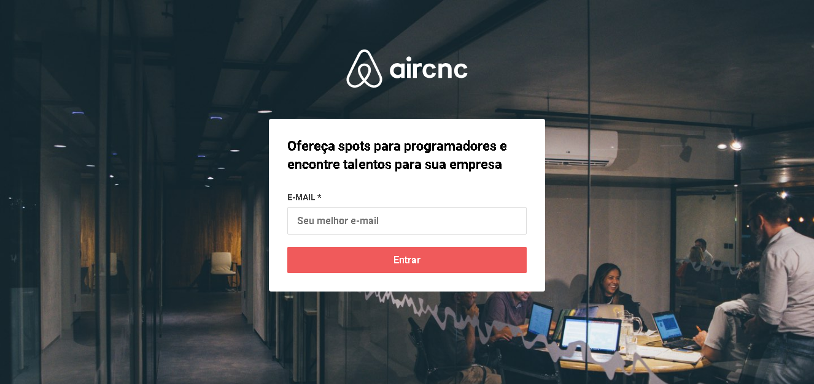
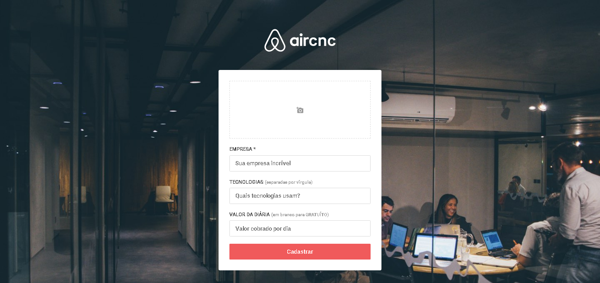
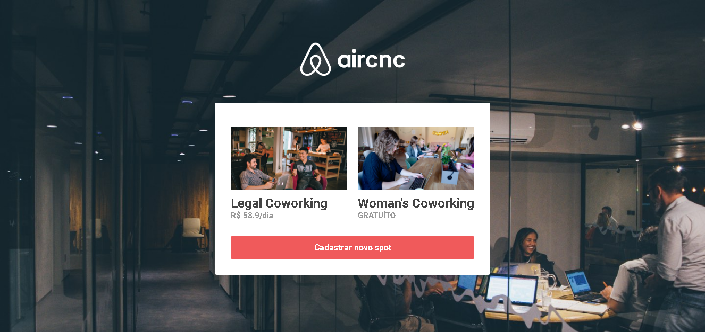

<h1 align="center">
    Aircnc
</h1>

## Tecnologias
Esse projeto foi desenvolvido com as seguintes tecnologias:

- [Node.js](https://nodejs.org/en/ "Node.js")
- [React](https://reactjs.org/ "React")
- [Expo](https://expo.io/ "Expo")

## Projeto

Código da aplicação desenvolvida durante a Semana OmniStack 9.0 da [Rocketseat](https://rocketseat.com.br "Rocketseat"), que visa conectar empresas que querem abrir spots e desenvolvedores que procuram um lugar para trocar ideias com devs, conhecer a empresa e trabalhar lá por um período.

## Telas

  
  
  

---
